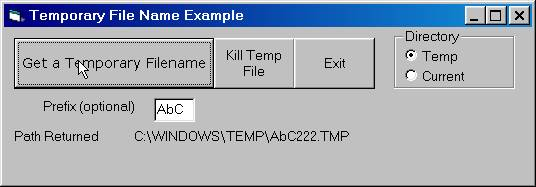



## Get a Temp File Name

### Description

Need to create a temporary file for whatever? Include this bas module in your project and with one line of code the file will be created and the name returned to your program. Sample project included.
 
### More Info
 

             |
---                |---
**Submitted On**   |2002-02-27 23:49:06
**By**             |[Louis Boldt](https://github.com/Planet-Source-Code/PSCIndex/blob/master/ByAuthor/louis-boldt.md)
**Level**          |Beginner
**User Rating**    |4.6 (23 globes from 5 users)
**Compatibility**  |VB 4\.0 \(32\-bit\), VB 5\.0, VB 6\.0
**Category**       |[Files/ File Controls/ Input/ Output](https://github.com/Planet-Source-Code/PSCIndex/blob/master/ByCategory/files-file-controls-input-output__1-3.md)
**World**          |[Visual Basic](https://github.com/Planet-Source-Code/PSCIndex/blob/master/ByWorld/visual-basic.md)
**Archive File**   |[Get\_a\_Temp582152282002\.zip](https://github.com/Planet-Source-Code/louis-boldt-get-a-temp-file-name__1-32177/archive/master.zip)

